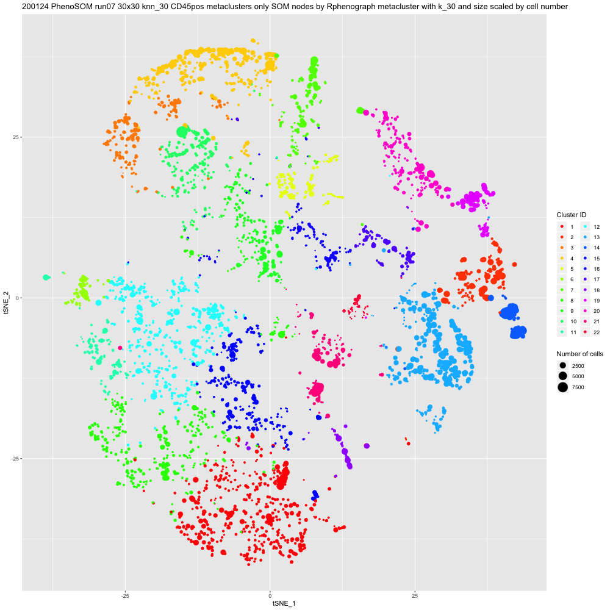
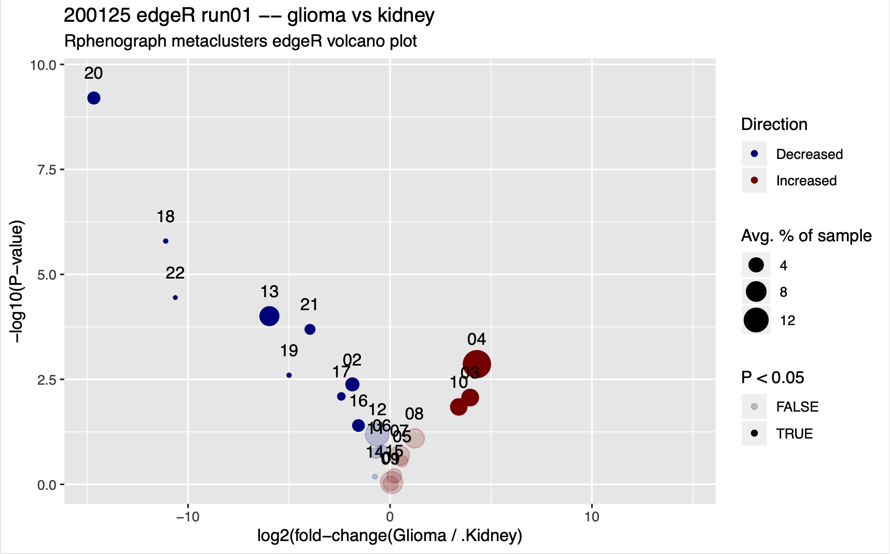

# PhenoSOM FR-FCM-Z3HK Demo
## Dataset:  Simonds et al. 2021 Figure 1A-C; FlowRepository accession ID FR-FCM-Z3HK

Note: The input data for this demo is 2.86GB. It takes about 3 hours (mostly unattended) to run this demo all the way through, from raw data to volcano plots. 

## Steps to run the demo:

1. Install the required PhenoSOM packages as described on the [main readme](../README.md)
2. Create an analysis folder and drop in the contents of the Zip archive from [FR-FCM-Z3HK_Demo](https://github.com/esimonds/PhenoSOM/tree/main/FR-FCM-Z3HK_demo)
3. In your analysis folder, create a subfolder called **FCSfiles**
4. Visit [FlowRepository accession ID FR-FCM-Z3HK](http://flowrepository.org/experiments/3637) and download the FCS files from the experiment with "Tcellpanel" in the filename. There should be 39 FCS files totaling about 2.86GB. Move these to the **FCSfiles** subfolder.
5. Run the **PhenoSOM demo FR-FCM-Z3HK.R** script and follow the prompts
6. After running Step 2, check if your output matches the figure in the demo. Open the PNG file located at **Your_analysis_folder/Maps and plots of SOM nodes/FR-FCM-Z3HK Panel 1 PhenoSOM Step 2 tSNE map of SOM nodes by Rphenograph metacluster k_30 and size scaled to cell number.png** 

It should look like this:

7. Continue with running Step 3.
8. After running Step 3, check if your output matches the figure in the demo. Open the PNG file located at **Your_analysis_folder/PhenoSOM_Step3_output/edgeR_Run1_Glioma_vs_Kidney/edgeR_Run1_Glioma_vs_Kidney metaclusters edgeR volcano plot.pdf**

It should look like this:

## Q: How long does each step take?
A:  About 2.5 hours for Step 1, 25 minutes for Step 2, and 1 minute for Step 3 (timing is based on a 2016 Macbook Pro).

## Q:  If the clustering results are stochastic, why does my output look identical to the demo?
A:  The script uses the command "set.seed(42)" to force a random seed of 42. This was the same seed used when running the data in the Simonds et al. (2021) paper and in the demo.
